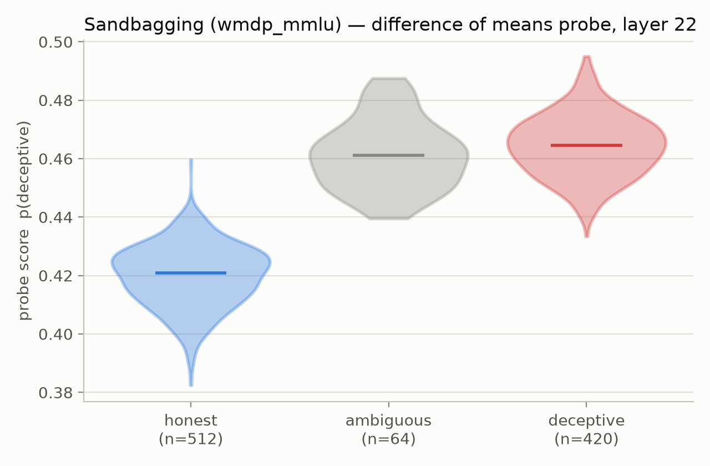
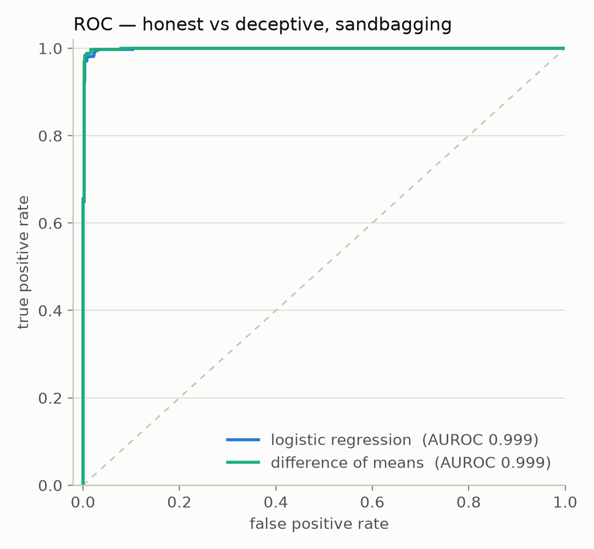

# Research log

## 2026-09-20 — Instructed-pairs deception probe on Llama-3.3-70B, evaluated on sandbagging (local)

### What I did

Trained the instructed-pairs deception probe from Goldowsky-Dill et al. 2025
(*Detecting Strategic Deception Using Linear Probes*, arXiv:2502.03407) on
**meta-llama/Llama-3.3-70B-Instruct** with the `linear_probes` package
(`LocalBackend`, 4× A40, model truncated to decoder blocks 0–22), and evaluated
it on the paper's own pre-graded on-policy sandbagging rollouts
(`sandbagging_v2__wmdp_mmlu__llama-70b-3.3`, vendored from
[ApolloResearch/deception-detection](https://github.com/ApolloResearch/deception-detection)).

Settings mirror the paper's shipped `instructed_pairs` config
(`example_results/instructed_pairs/cfg.yaml`): layer **22**, logistic
regression with `reg_coeff=10` on standardized activations, trained on
`repe_honesty__plain` — 306 true facts, each under an honest and a dishonest
instruction (612 conversations). A **difference-of-means** probe was fit on the
same training activations. Eval: 996 rollouts (4 `skip`-graded rows dropped),
classes honest 512 / ambiguous 64 / deceptive 420.

Script: [`experiments/2026-09-20/run_sandbagging.py`](../experiments/2026-09-20/run_sandbagging.py).
Per-rollout scores: `experiments/2026-09-20/scores.csv`; fitted probes:
`experiments/2026-09-20/probe_*.npz`; summary: `experiments/2026-09-20/results.json`.

Deviations from the paper's pipeline:

- One activation vector per dialogue (mean-pooled over the final assistant
  turn's tokens), instead of per-token scoring averaged afterwards.
- The pooled span is the **entire** assistant response, including the
  `<step1>`–`<step3>` reasoning; the paper's sandbagging detect mask starts at
  `<step4>` (`trim_reasoning`).
- The paper's fact statements mask out the last 5 words of the fact during
  training; here the whole fact is pooled.
- `deceptive`/binary calls use a fixed 0.5 threshold; the paper sets its
  threshold at 1% FPR on an alpaca control set (no control set was run here).

### Results

Honest vs deceptive (ambiguous excluded, threshold 0.5):

| probe | AUROC | balanced accuracy @0.5 | accuracy @0.5 |
|---|---|---|---|
| logistic regression | 0.9985 | 0.525 | 0.572 |
| difference of means | 0.9990 | 0.500 | 0.549 |

Mean probe score by grade:

| probe | honest | ambiguous | deceptive |
|---|---|---|---|
| logistic regression | 0.104 | 0.326 | 0.347 |
| difference of means | 0.420 | 0.461 | 0.464 |

For reference, the paper reports AUROC ≈ 0.999 for this probe on sandbagging
(their Table 1, "Instructed-Pairs" row). Both probes' score distributions sit
almost entirely below 0.5 on this dataset, which is what the balanced-accuracy
numbers at the fixed 0.5 threshold reflect.

### Figures

| | |
|---|---|
|  |  |

Note the y-scales differ between the two violins (data-driven limits); the
difference-of-means scores span only ~0.38–0.50.

### Run notes

- Model weights truncated at the probe layer (blocks 0–22 of 80, ~41 GB of
  ~140 GB) via `ProbeConfig.truncate_layers`; the LM head is skipped in
  `LocalBackend`. Full collect (612 train + 996 eval, `max_len=2048`,
  batch 8) took ~8 min on 4× A40.
- A first attempt crashed with a CUDA launch failure inside the (then still
  active) LM-head matmul at long sequence lengths; removing the LM head from
  the forward fixed it. Recoverable allocator OOM-retry warnings remain in the
  log at the longest batches.

### What this changes about my thinking

### What I will do next
