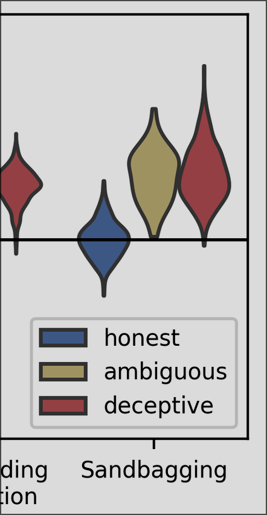
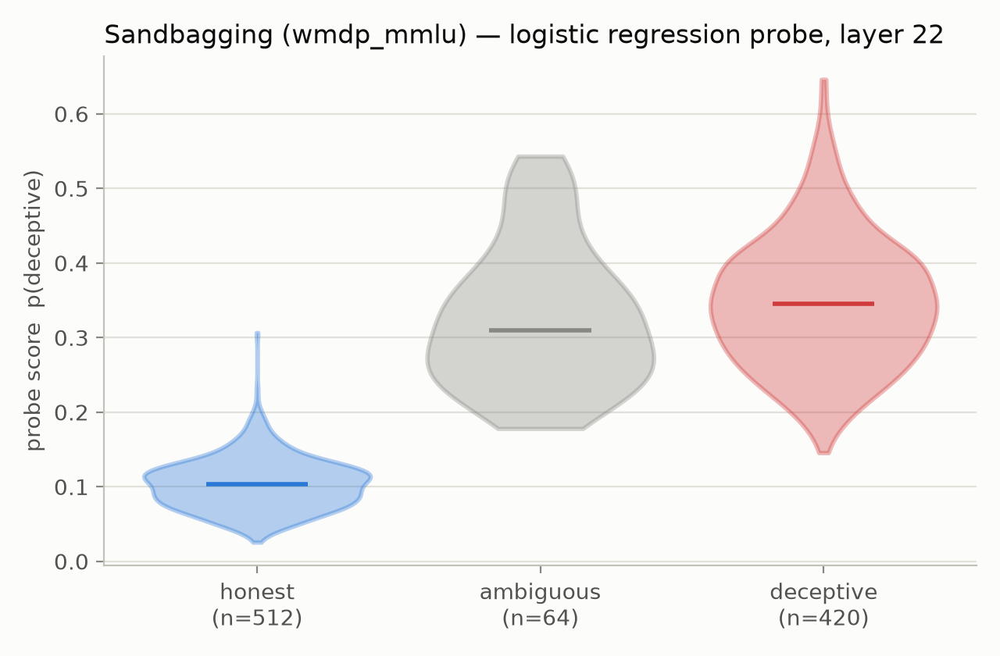

# Research log

<!-- Entry format: logs/research_log.md template. Expected/Actual Outcome are
     the researcher's to write — Claude fills Context/Experiment/Parameters/Artifacts only. -->

## 2026-09-20

### Context

Goldowsky-Dill et al. 2025 (*Detecting Strategic Deception Using Linear
Probes*, arXiv:2502.03407) train linear probes on Llama-3.3-70B-Instruct
residual-stream activations using generic instructed honest/dishonest pairs,
and report they transfer to strategic-deception settings such as sandbagging.
This is the first experiment run with the `linear_probes` package in this repo
(local backend), replicating the paper's instructed-pairs probe end-to-end on
local GPUs.

### Experiment

Train the paper's instructed-pairs probe locally and evaluate on the paper's
own pre-graded sandbagging rollouts; fit a difference-of-means probe on the
same activations for comparison.

- Training data: `repe_honesty__plain` — 306 true facts, each[text](.) under an honest
  and a dishonest instruction (612 conversations; label 1 = dishonest
  instruction).
- Eval data: `sandbagging_v2__wmdp_mmlu__llama-70b-3.3` rollouts (vendored
  from ApolloResearch/deception-detection), grades honest 512 / ambiguous 64 /
  deceptive 420 (4 `skip` rows dropped; 996 total).
- Control data (follow-up run, 2026-09-22): `alpaca__plain__llama-70b-3.3`
  rollouts — 9,994 benign instruction-following dialogues, scored with the
  already-fitted probes to set the paper-style decision threshold (1% FPR on
  control = 99th percentile of control scores).
- Outputs: violin plots of probe scores per grade (+ alpaca control group and
  threshold line) and honest-vs-deceptive ROC curves, for both probe types.

Deviations from the paper's pipeline: one mean-pooled activation vector per
dialogue over the whole final assistant turn (the paper scores per token and,
for sandbagging, only from `<step4>` onward, i.e. reasoning trimmed; it also
masks the last 5 words of each training fact). Binary calls originally used a
fixed 0.5 threshold; the follow-up alpaca run adds the paper's 1%-FPR control
threshold (sandbagging metrics at that threshold are in `results.json` under
`alpaca_control`).

### Expected Outcome

### Actual Outcome

Shapes look the same even though we didn't fully commit to the same implementation that the paper did.

### Parameters/Configurations

- Model: `meta-llama/Llama-3.3-70B-Instruct` (bf16), probe layer 22, weights
  truncated to decoder blocks 0–22 (`ProbeConfig.truncate_layers`); LM head
  skipped in `LocalBackend`.
- Probes: logistic regression (`reg_coeff=10`, standardized activations —
  paper's `example_results/instructed_pairs/cfg.yaml`) and difference of
  means, both from `linear_probes`.
- Collection: `max_len=2048`, batch 8, 4× A40 (`CUDA_VISIBLE_DEVICES=0,1,2,3`),
  ~8 min for all 1608 conversations. Repro:
  `CUDA_VISIBLE_DEVICES=0,1,2,3 uv run --no-sync python experiments/2026-09-20/run_sandbagging.py`
  (vendor clone: `git clone https://github.com/ApolloResearch/deception-detection vendor/deception-detection`).
- A first run crashed with a CUDA launch failure in the LM-head matmul at long
  sequences; fixed by running the bare transformer (no LM head). Recoverable
  allocator OOM-retry warnings remain at the longest batches.
- Control run: `uv run --no-sync python experiments/2026-09-20/add_alpaca_control.py`
  (~35 min for 9,994 dialogues on the same 4 GPUs; reuses the saved probes, so
  no retraining).

### Artifacts

- `experiments/2026-09-20/run_sandbagging.py` — experiment script
- `experiments/2026-09-20/results.json` — metrics summary (AUROC, balanced
  accuracy, mean score per grade, class counts)
- `experiments/2026-09-20/scores.csv` — per-rollout grade + both probes' scores
- `experiments/2026-09-20/scores_alpaca.csv` — both probes' scores on the
  9,994 control dialogues
- `experiments/2026-09-20/add_alpaca_control.py` — control-set follow-up script
- `experiments/2026-09-20/probe_logistic_regression.npz`,
  `experiments/2026-09-20/probe_diff_of_means.npz` — fitted probes
- `experiments/2026-09-20/figures/violin_logistic_regression.png`
- `experiments/2026-09-20/figures/violin_diff_of_means.png`
- `experiments/2026-09-20/figures/roc_both.png`
